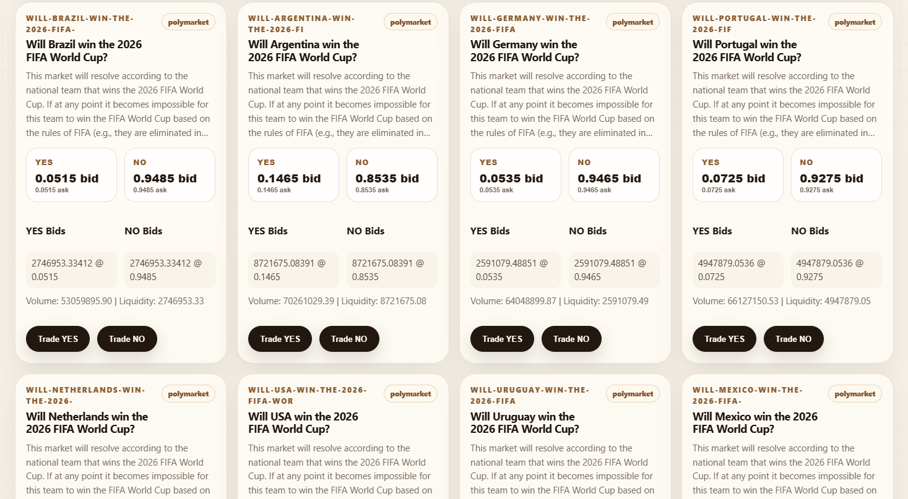
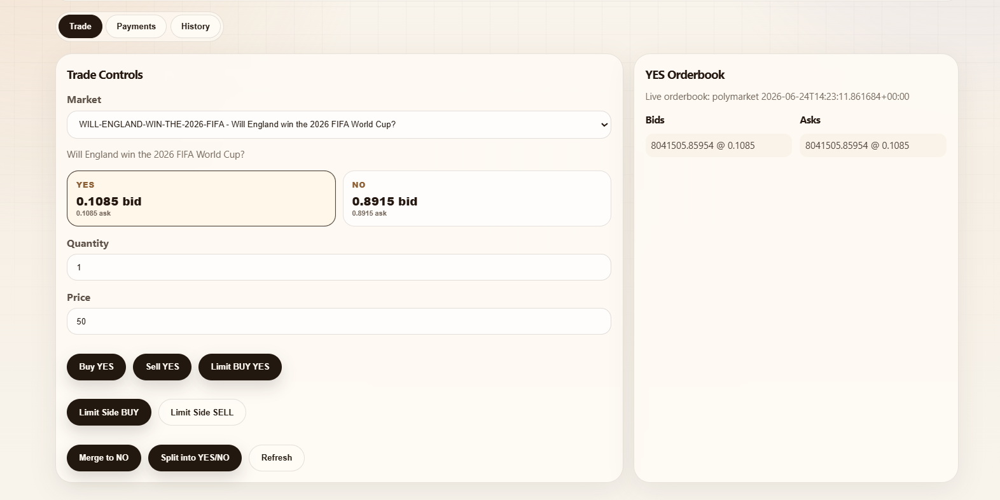

# Trading Platform

Auth-free prediction market demo with public YES/NO bids, local account signup, trading actions, payments, and an admin console.

## Screenshots

Add project images here later:






## Features

- Browse live Polymarket YES/NO markets before signing up.
- Get Started opens the dashboard; sign in/up is required only when performing trading operations.
- Store users in SQLite with hashed passwords and encrypted Solana wallet addresses.
- Stream live YES/NO orderbook updates over WebSocket.
- Buy, sell, limit, split, merge, deposit, and withdraw.
- FastAPI backend with SQLite runtime storage.
- React + Vite frontend served by Nginx in Docker.
- Admin console for markets, monitoring, users, and operations.

## Quick Start With Docker

```bash
docker compose up --build
```

Open:

- App: http://localhost:5173
- API health: http://localhost:8000/health
- API docs: http://localhost:8000/docs

SQLite data is stored in the `trading_data` Docker volume.

If `/api/markets` returns `502`, the backend container is not running or is unhealthy. Run:

```bash
docker compose ps
docker compose logs backend
docker compose up --build
```

## Local Development

Backend:

```bash
cd backend
python -m venv .venv
.venv/Scripts/activate
pip install -r requirements.txt
uvicorn app.main:app --reload --port 8000
```

Frontend:

```bash
cd frontend
npm install
npm run dev
```

## Project Structure

```text
backend/              FastAPI API, matching engine, SQLite schema
frontend/             React UI and Nginx production config
docker-compose.yml    Local Docker deployment
CONTRIBUTING.md       Contribution guide
CODE_OF_CONDUCT.md    Community rules
LEARN.md              Guided explanation of the project
```

## Useful Commands

```bash
cd frontend && npm run lint && npm run build
python -m py_compile backend/app/main.py
docker compose config
docker compose down
docker compose down -v
```

## Market Data

By default, Docker uses live Polymarket public market data:

```env
MARKET_DATA_SOURCE=polymarket
POLYMARKET_GAMMA_URL=https://gamma-api.polymarket.com
TRADING_ENCRYPTION_KEY=replace-with-a-long-random-secret
```

Set `MARKET_DATA_SOURCE=local` to use only the SQLite demo markets.

## Contributing

Contributions are welcome. Read [CONTRIBUTING.md](CONTRIBUTING.md) and follow the [Code of Conduct](CODE_OF_CONDUCT.md).

## License

MIT. See [LICENSE](LICENSE).
